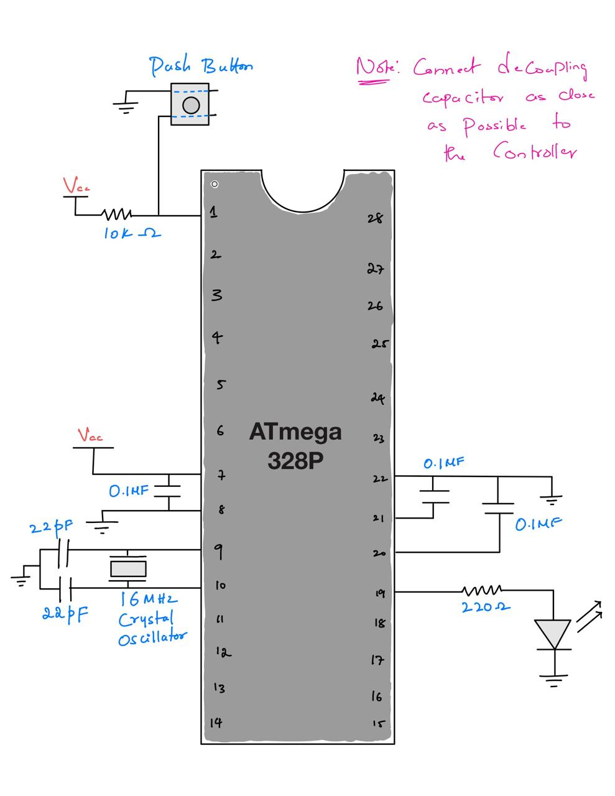
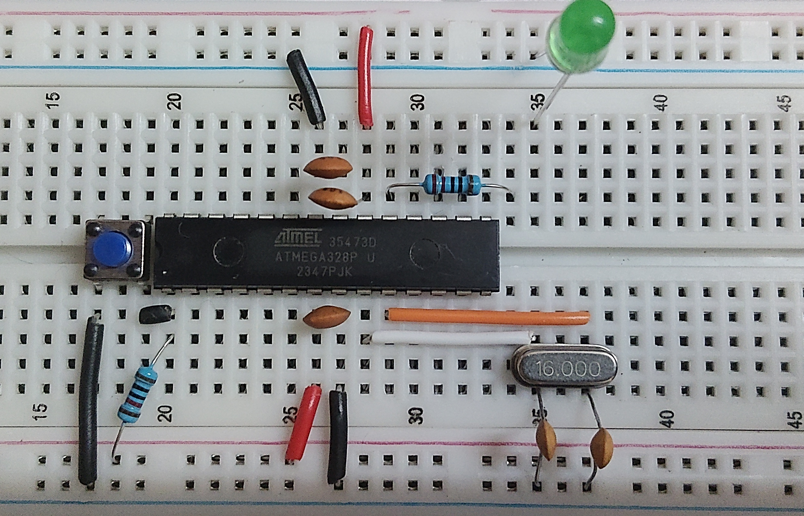
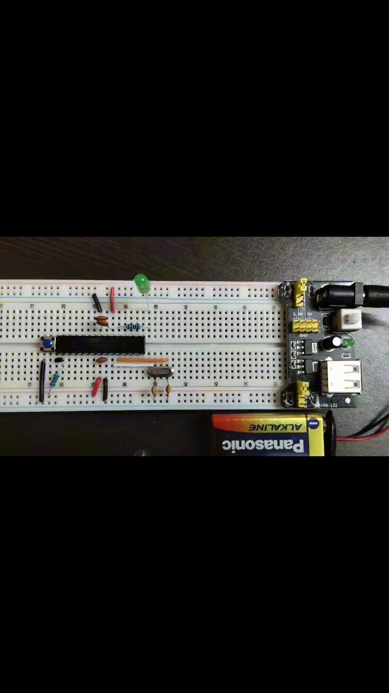

<div align="center">

# ATmega328P Bare-Metal Blinky

A minimalist, register-level LED blink implementation for the ATmega328P. This project avoids the Arduino framework and standard libraries, demonstrating pure bare-metal AVR C development.

</div>

If you're looking for `digitalWrite()`, this is not that project.


## Features

- **No Libraries:** Direct register manipulation (GPIO, Timers).
- **Interrupt Driven:** Uses Timer1 in CTC mode with hardware interrupts.
- **Low Power:** Utilizes the `sleep` instruction for an idle main loop.
- **Custom Linker:** Includes a basic `linker.ld` for memory mapping.

## Target Hardware:

| Component | Value |
|-----------|-------|
| MCU | ATmega328P |
| USB ISP AVR programmer | 1 |
| Crystal Oscillator | 16 MHz external crystal |
| Resistor | 1 * 220 Ω, 1 * 10KΩ |
| Capacitor | 2 * 22pF, 3 * 0.1µF |
| Push Button | 1 |
|  LED | 1 * (Any color) |
|  Breadboard | 1 |
| And offcourse some wires to connect these components |

## Hardware Setup 

### Wiring Diagram

    
### Breadboard Layout

    
## Demo




## Quick Start

### Prerequisites

You need the AVR toolchain installed:

- `avr-gcc` — AVR C compiler
- `avr-binutils` — Binary utilities (includes `avr-objcopy`)
- `avr-libc` — C library for AVR
- `avrdude` — Programmer utility

### 1. Install Toolchain
```bash
# Debian/Ubuntu
sudo apt install gcc-avr avr-libc binutils-avr avrdude
```

### 2. Build & Flash
```bash
# Build the .hex file
make

# Flash via USBasp
make flash
```

## How It Works

The timing is handled by **Timer1** (16-bit) configured in **CTC (Clear Timer on Compare)** mode.

The LED blinks at exactly **1 Hz** (1 second on, 1 second off) using Timer1:

```
Timer Frequency = F_CPU / (Prescaler × (1 + OCR1A))
                = 16,000,000 / (256 × 62,500)
                = 1 Hz
```

When Timer1 reaches the compare value (62499), it triggers an interrupt that toggles the LED and resets the counter automatically (CTC mode).


## Project Structure

***atmega328p_baremetal_blinky*** \
  |-> `src/` \
  |     '-> `blink.c`: main sourse code \
  |-> `linker.ld`: Linker script defining memory layout. \
  |-> `Makefile`: Build and flash automation. \
  |-> `datasheet/`: Reference documentation. \
  '-> `images/`: Wiring and demo assets. 

## License
MIT License. See [LICENSE](LICENSE) for details. \
This project is provided as-is for educational purposes. Feel free to use and modify.
